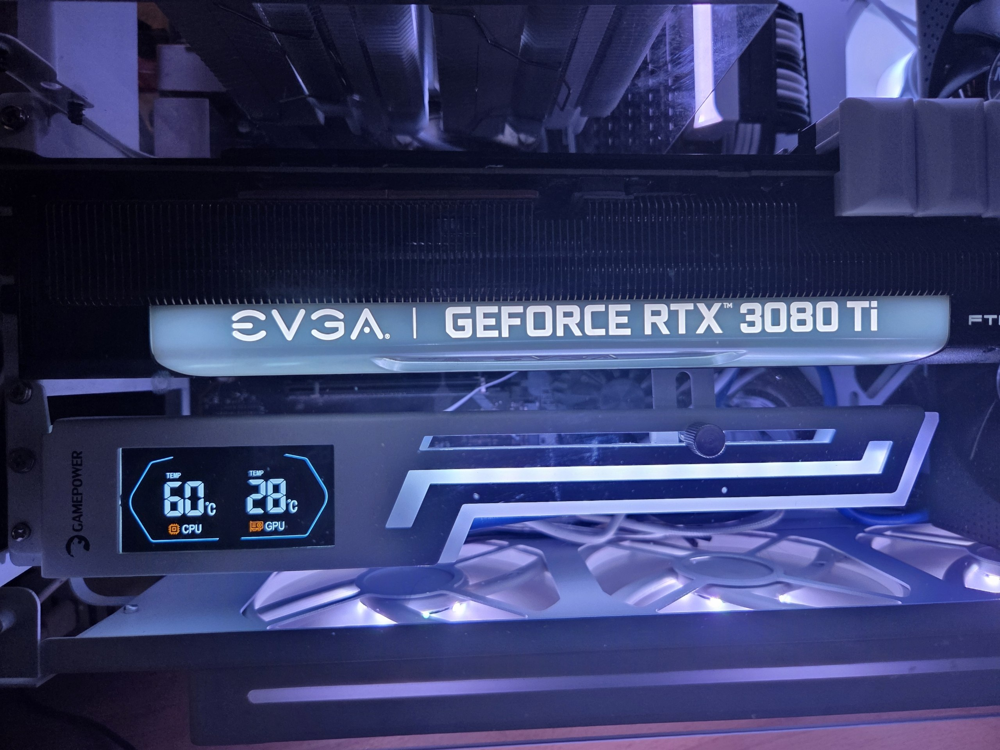
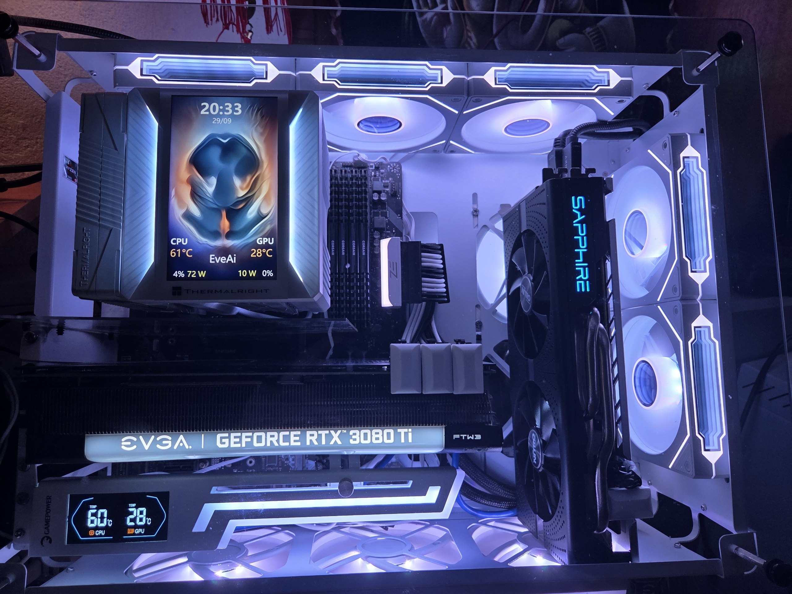

# Gamepower HeatSync on Linux

Linux live telemetry and an autostart installer for the Gamepower HeatSync / USB35INCH LCD GPU holder.

<p align="center">
  
  
</p>
<p align="center"><sub>Photos show the working Linux setup described below.</sub></p>

## What it solves

The HeatSync screen is driven by companion software. This project lets Linux users feed it live readings without running the Windows app under an emulator. It replaces fixed or dummy-looking values with CPU and GPU temperatures; its side bars reflect CPU and GPU utilization.

## How it works

The Python program reads AMD CPU temperature from `k10temp`, CPU utilization from `/proc/stat`, and NVIDIA GPU temperature/utilization from `nvidia-smi`. It sends the values to the holder over its USB serial interface using the observed 115200-baud Gamepower status packet. The included installer checks prerequisites, installs supported Ubuntu packages, and enables a per-user systemd service for updates at login. It does not alter motherboard ARGB or control the Thermalright/TRCC cooler display.

## Hardware and current support

Hardware-confirmed configuration: Ubuntu 26, AMD Ryzen 9 5950X, NVIDIA GeForce RTX 3080 Ti, and a Gamepower HeatSync holder. The observed USB serial device identifies as `1a86:5722` and `USB35INCHIPSV2`; its Linux stable path was:

```text
/dev/serial/by-id/usb-Turing_UsbMonitor_USB35INCHIPSV2-if00
```

The device may enumerate differently on another machine. Pass its actual path with `--port` if needed. Live metrics have been confirmed on this setup. Other CPUs, GPUs, HeatSync models, and firmware revisions are unverified. The installer has had syntax and configuration checks; it still needs a clean-machine installation check before a stable release.

## Requirements

- Python 3
- pySerial (`python3-serial` on Ubuntu)
- `lm-sensors` with an AMD `k10temp` Tctl or Tdie reading
- `nvidia-smi` for NVIDIA GPU temperature and utilization
- Access to the serial device (usually membership in the `dialout` group)

Install the Ubuntu packages if needed:

```bash
sudo apt install python3-serial lm-sensors
```

Check that `sensors -j` includes `k10temp` and that `nvidia-smi` reports the intended GPU before starting the sender.

## Install automatically

Download the installer, inspect it if you like, then run it as your normal desktop user (not with `sudo`):

```bash
curl -fLO https://raw.githubusercontent.com/firedesiresa-bit/gamepower-heatsync-linux/main/install.sh
less install.sh
bash install.sh
```

The installer downloads the project source, installs missing Ubuntu packages (`python3`, `python3-serial`, `lm-sensors`, and CA certificates) through APT, checks the AMD sensor, NVIDIA telemetry command, serial device, and user access, then installs and starts the user systemd service. It may ask for your password for APT. If `nvidia-smi` is missing but an APT-installed NVIDIA driver is present, it installs that driver's matching utilities package. It does not install or replace the NVIDIA driver itself.

For a different serial path, use `bash install.sh --port /dev/serial/by-id/YOUR_DEVICE`. To install without starting the service, pass `--no-activate`.

## Run

```bash
python3 heatsync_linux.py
```

The sender updates once per second. Use `Ctrl+C` to stop. For a single update:

```bash
python3 heatsync_linux.py --once
```

Useful options:

```text
--port PATH       serial device (default: the USB35INCH by-id path above)
--gpu-index N     NVIDIA GPU index used by nvidia-smi (default: 0)
--interval SEC    update interval, at least 0.2 seconds (default: 1)
```

## Optional start at login

Install the script and user service:

```bash
install -Dm755 heatsync_linux.py "$HOME/.local/bin/gamepower-heatsync"
mkdir -p "$HOME/.config/systemd/user"
install -Dm644 systemd/gamepower-heatsync.service \
  "$HOME/.config/systemd/user/gamepower-heatsync.service"
systemctl --user daemon-reload
systemctl --user enable --now gamepower-heatsync.service
```

Inspect the service and its sensor readings:

```bash
systemctl --user status gamepower-heatsync.service
journalctl --user -u gamepower-heatsync.service -f
```

Stop and disable it with:

```bash
systemctl --user disable --now gamepower-heatsync.service
```

## Protocol notes and limits

- The vendor app opens a serial port at 115200 baud, 8N1, with DTR and RTS enabled and flow control disabled.
- Status updates are 20-byte packets using command `0xA9`. The temperature digits are in payload positions 0–3 (wire bytes 6–9).
- The Windows app cycles payload positions 4 and 5 through values 0–7 for its side bars. This driver maps those slots to eight steps derived from CPU and GPU utilization. This bar mapping is inferred from the observed animation fields.
- The packed command header passes CPU utilization and GPU temperature in the fields observed in the vendor call. The packet does not expose a separate GPU utilization header field in this update.
- CPU temperature is read from AMD `k10temp` Tctl/Tdie. GPU temperature and utilization come from `nvidia-smi`. Intel CPUs, AMD GPUs, other sensor layouts, and other device firmware have not been verified.
- No vendor binaries, serial captures, or decompiled source are included. The packet description above is based on static analysis of the vendor app and a local serial trace.

## Troubleshooting

- If the device cannot be opened, close the vendor app and any other process using the HeatSync serial port. The driver uses an exclusive serial open.
- Check permissions with `ls -l /dev/ttyACM*` and confirm the account is in `dialout`. A new group membership requires a fresh login.
- If startup fails, inspect `journalctl --user -u gamepower-heatsync.service` for sensor or port errors.
- Find the current stable device path with `ls -l /dev/serial/by-id/` and pass it using `--port`.

## License

MIT. See [LICENSE](LICENSE).
